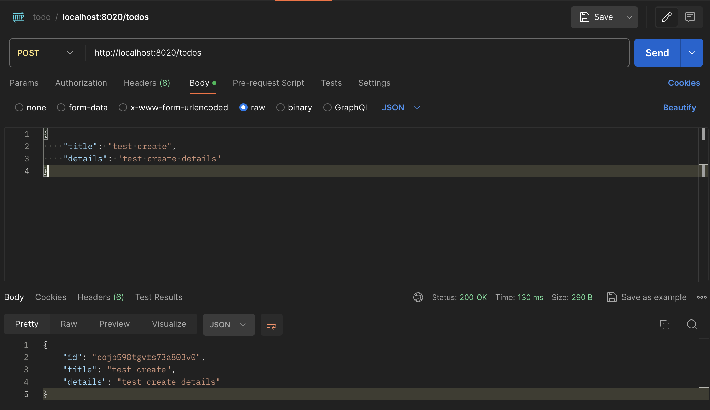
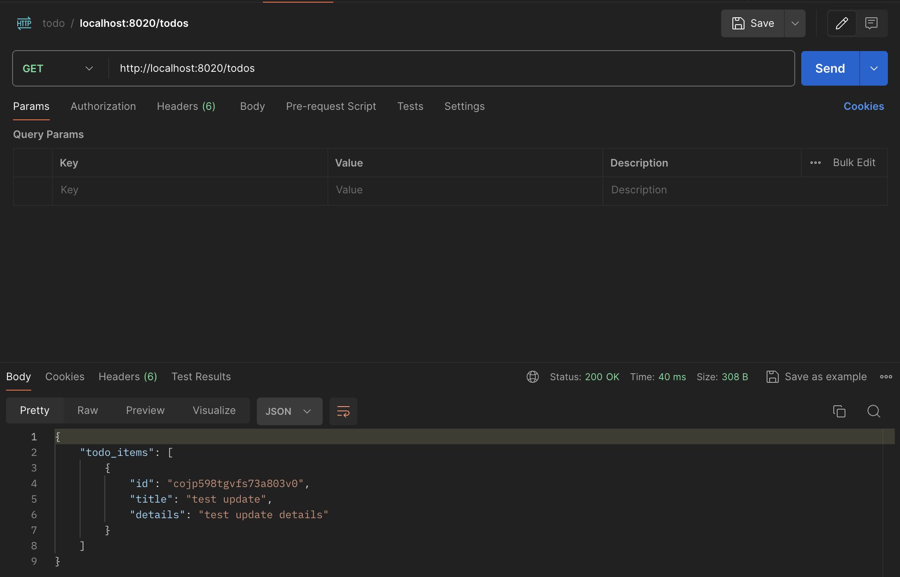
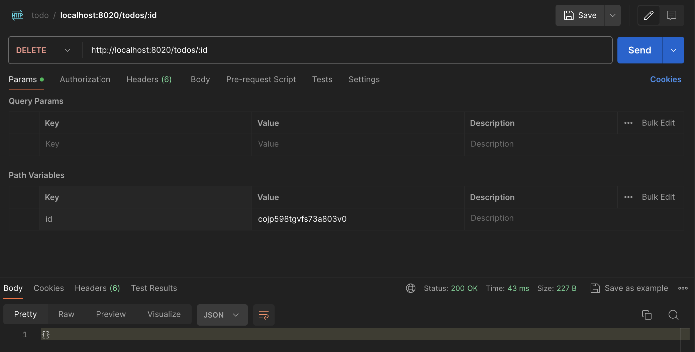
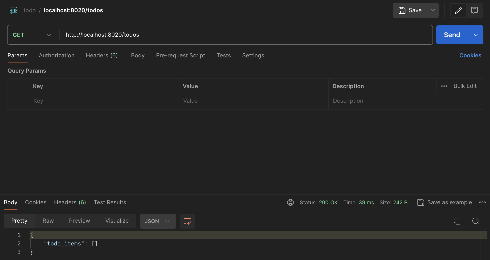

# ToDoApp

API endpoints:

```bash
GET http://localhost:8020/todos            # for listing all to-do items
POST http://localhost:8020/todos           # for creating a to-do item
PUT http://localhost:8020/todos/:id        # for updating a to-do item
DELETE http://localhost:8020/todos/:id     # for deleting a to-do item
```

## Demo

You can make HTTP requests in Postman.
First we create a to-do item with POST request.


You can update previously created to-do item with PUT request. You can partially update to-do item by providing either `title` or `details` in `update_mask` field.


You will see the updated to-do item if you call GET request to list all to-do items.


You can delete the to-do item.


And you will get empty list if you make GET request.

