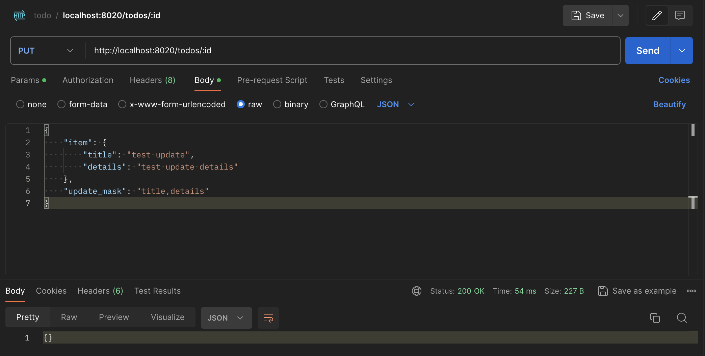

# ToDoApp

API endpoints:

```bash
GET http://localhost:8020/todos            # for listing all to-do items
POST http://localhost:8020/todos           # for creating a to-do item
PUT http://localhost:8020/todos/:id        # for updating a to-do item
DELETE http://localhost:8020/todos/:id     # for deleting a to-do item
```

You can make HTTP requests in Postman. Here is an example for PUT request, assuming you have already created
a to-do item with POST request and want to update the to-do item.

